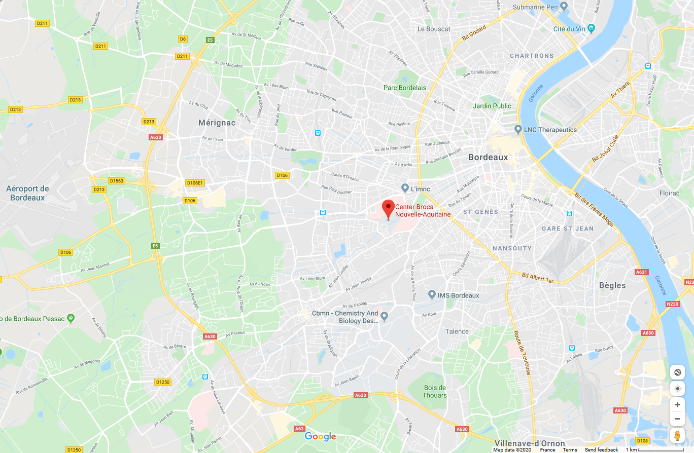

# NEUBIAS Bioimage Analyst School 2020

Dates: Feb. 29 - Mar.3, 2019
Place: Bordeaux

Organizers: 

- Marion Louveaux (Institut Pasteur, France) 
- Kota Miura (Heidelberg University, Germany)

## Aim

The aim of NEUBIAS Bioimage Analyst School is to provide **bioimage analysts** with practical access to the latest bioimage analysis workflows and their components [1]. Many tools for bioimage analysis are updated and new ones are appearing on daily basis, but analysts tend to be constrained to what one knows already. They are too busy to test and use all those new tools. We hope that this school will be a good chance for analysts to test something new by the exposure to workflows and their components, and also to widen their scope and broaden their skills. In addition to this primary aim, the school also aims for the community building among bioimage analysis experts - it's always good to have friends with similar interests!

The program is evolving every year. The program in Bordeaux is designed based on the experiences in three previous schools in Lisbon (2017), Szeged (2018) and Luxembourg (2019). As many of the participants commented that we need to have more modules with statistical treatments of data, we will have a stronger focus on those aspects in this school, for example in the context of recent announcements from the statistics community [2-4]... but more.  The school is followed by a half-day "**BioImage Analyst Satellite Meeting**", accepting more participants than the school, where bioimage analysts exchange practical information and discuss in a non-formal interactive sessions. 

1. Miura, Paul-Gilloteaux, Tosi, & Julien Colombelli. “Workflows and Components of Bioimage Analysis.” In Bioimage Data Analysis Workflows, edited by Kota Miura and Nataša Sladoje, 1–7. Learning Materials in Biosciences. Cham: Springer International Publishing, 2020. https://doi.org/10.1007/978-3-030-22386-1_1.

2. [The ASA Statement on p-Values: Context, Process, and Purpose](https://amstat.tandfonline.com/doi/full/10.1080/00031305.2016.1154108#.XInvWyPMzyW)

3. [Scientists rise up against statistical significance](https://www.nature.com/articles/d41586-019-00857-9)

4. [The Significant Problem of P Values](https://www.scientificamerican.com/article/the-significant-problem-of-p-values/)

## Place and Time

### Place

[Centre Broca Nouvelle-Aquitaine](https://www.bordeaux-neurocampus.fr/)

Bordeaux, France: [Google Map](https://goo.gl/maps/8hU1FyiToT3Nny4c6)    

### Time

Feb 29 (Sat), 11:00  - Mar 3 (Tue) 13:00, 2019

- Registration starts from 10:00 on the first day

### Links

- [The school page @ neubias.org](http://eubias.org/NEUBIAS/training-schools/analysts/ts15-bordeaux-2020/) - please register via this link. 

## The program 

|             | Day 1 (Feb. 29)                            | Day 2 (Mar. 1)                  | Day 3 (Mar. 2)                              | Day 4 (Mar. 3)                          |
| ----------- | ------------------------------------------ | ------------------------------- | ------------------------------------------- | --------------------------------------- |
| Morning 1   | Introduction                               | Statistics / Marten Postma      | Machine Learning / Ignacio Arganda-Carreras | P-values / Estibalitz Gomez de Mariscal |
| Morning 2   | Workflow lecture, Stéphane Verger          | continued                       | continued                                   | Presentations                           |
| Afternoon 1 | Workflow Deconstruction by Stéphane Verger | Python Data Analysis / Plotting | Selected Workflow Presented by Students     | (Analyst's Satellite Mtg)               |
| Afternoon 2 | continued.                                 | Implementation                  | Implementation                              | (Analyst's Satellite Mtg)               |

The school is based on the concepts of "workflows and components" in bioimage analysis ([more details here](https://link.springer.com/chapter/10.1007/978-3-030-22386-1_1)) and will be with four types of modules: **Workflow Deconstruction**, **Advanced Usage of Workflow Components**, and **Implementation** (Workflow Deconstruction by students). 

In **Workflow Deconstruction**, we first reproduce the workflow instructed by the author. 

- Tracing the workflow, starting with sample image data, understand the biological problem, do image processing and data analysis, ends up in numbers, plots or visualizations. 
- Explanation for each step (or each component) are given and interesting algorithms are picked up and discussed in details. 
- Each participant uses ones own laptop to reproduce / modify the workflow

 Interactive discussion on following points will be moderated.

- Components and algorithms used: discuss alternatives
- The overall design of the workflow: could there be better ways, better tools?

In **Advanced Usage of Workflow Components**, invited experts present in-depth explanation about workflow components, and explain efficient access to the API (We call this **API-beating**). This training is aiming to encourage participants to expand their skill and technique to utilize cutting-edge components in their workflow they construct in future. 

In **Implementation (Workflow Deconstruction by Students)**, participants are split into several groups, and each group make trials based on their own idea to do modifications / replacements / benchmarking. For example:

1. The full workflow running in different ecosystems
2. a part of the workflow replaced with a different component.
3. Reuse of certain component blocks for different biological problems
4. Implementing some components in other language and compare the performance
5. Alternative workflow, solutions, discussion on capability in other ecosystems, tools or approaches.  

## Participation Requirements

Participants are expected to be bioimage analysts, analyzing biological image data on daily basis. 

Please bring your own laptop! We do not provide machines.  

We expect some fluency in at least one programming language. We do not teach coding, but intensively do coding using several different languages. Skills / flexibility to follow such sessions are a prerequisite. Specific workflow organizers will however provide some 'homework' to prepare for their module, containing leads to learn a language and prepare for the installation of the required softwares on your laptop.

**There will be no helpers during all sessions.** We rather promote attending bioimage analysts to to help each other, also for the networking.

During registration, the applicant is asked to submit at least one bioimage analysis workflow that one has authored / worked on (starting with a specific biological question, describe the workflow in a short paragraph and the type of results: numbers, plots and/or visualization - does not have to be a published paper). Among these applicants, some are selected for presentation as "Workflow Deconstruction" session and lead the session. 

## Workflow Deconstruction

- This year, [Stéphane Verger](https://www.upsc.se/researchers/5435-verger-stephane-mechanics-and-dynamics-of-cell-to-cell-adhesion-in-plants.html) will guide us through the Workflow in the following paper:
   - The paper
     - **Verger, S.**, Long, Y., Boudaoud, A., Hamant, O. (2018). **A tension-adhesion feedback loop in plant epidermis.** eLife. 7, e34460. (https://elifesciences.org/articles/34460)
     - Erguvan, O., **Louveaux, M**., Hamant, O., **Verger, S**. (2019) ImageJ SurfCut: a user-friendly pipeline for high-throughput extraction of cell contours from 3D image stacks. BMC Biology, 17:38. (https://doi.org/10.1186/s12915-019-0657-1)
   - The [GitHub repo](https://github.com/sverger/SurfCut)
   
- Details of [Preparation and Homework]()

## Advanced Workflow Components

###  1: Dealing with Numbers: Statistics

- Lead: [Marten Postma](http://www.martenpostma.nl/science/)
- Topics (tentative)
  - Accuracy of measurements) 
  - Standard deviation vs standard error 
  - How to deal with pooled mean values 
  - How many samples (n) do we need? 
  - Where is the variance coming from? biological systems, measurement error or the analysis?
  - Computation of confidence interval. 
  - Surviving the post p-values era

### 2: Python Data Analysis / Plotting Libraries

- Lead: [Arianne Bercowsky Rama](https://people.epfl.ch/arianne.bercowskyrama?lang=en) 
  
### 3: Machine Learning / Deep Learning

  - Lead: [Ignacio Arganda-Carreras](https://sites.google.com/site/iargandacarreras/) 
  - Topics (tentative)
      - Overview, Machine Learning & Deep Learning
      - Tweaking Advanced Weka Segmentation
      - DeepIJ with normal computational resources

###  Lecture: Use of the p-value as a size-dependent function: model and applications

- Speaker: [Estibalitz Gomez de Marisca]l(https://image.hggm.es/en/estibaliz-gomez)
- A talk based on her preprint: "Confronting p-hacking: addressing p-value dependence on sample size", bioarxiv, doi: https://doi.org/10.1101/2019.12.17.878405

## Workflows, Student Presentations

Some workflows submitted by participants during registration will be selected for presentation during the school. 

## Implementations / Presentations

School participants are asked to present their implementations (by group) on the last day of the school. 7 groups, 15 minutes presentation + 5 minutes questions and answers. 

## Time Table

Tentative schedule: [google sheet link](https://docs.google.com/spreadsheets/d/e/2PACX-1vRdkYCOvhYFrdBakOI3rvroARG2aRfwubFaOGTyvLI9ml-49WBP2A011Q7l_PLn4rUcHaXn2N7O4gmU/pubhtml?gid=0&single=true) 

It's going to be great!
